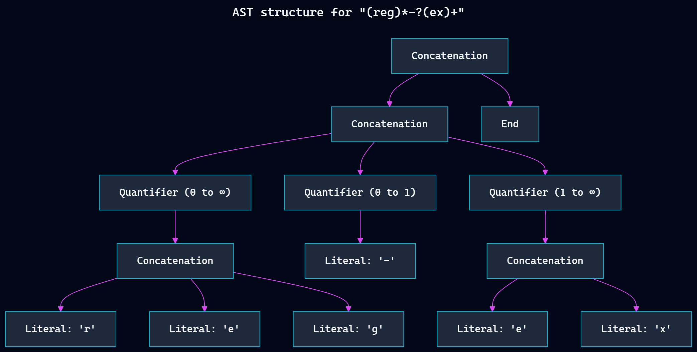

# Regex-Engine - Petnica Science Center class of '26 project

## Regex-Engine
This repo contains my Python implementation of a **Non-deterministic Finite Automaton** (NFA) **Regex engine**. The benefit of an NFA Regex engine is its support for advanced features (such as **backreferences**, **lazy quantifiers**, and **lookarounds**), though it faces the risk of catastrophic backtracking. NFA engines are the standard and are implemented in the default libraries of Python, Perl, JS, JAVA, .NET, PHP, Ruby, and many more languages.

## Features
Regex-Engine is a functional NFA regex engine built from scratch without external regex libraries. It parses regular expressions into an **Abstract Syntax Tree** (AST) and evaluates strings via backtracking. 
**Below is a render of the Abstract Syntax Tree for** `"(reg)*-?(ex)+"`.

### Supported Metacharacters and Syntax
* **Literals:** Matches exact string characters.
* **Wildcard (`.`):** Matches any single character (except newlines).
* **Concatenation (`abc`):** Sequential character matching.
* **Alternation (`a|b`):** Matches either the expression on the left or the right.
* **Quantifiers (Greedy):**
    * `*` : Matches the preceding element zero or more times.
    * `+` : Matches the preceding element one or more times.
    * `?` : Matches the preceding element zero or one time.
* **Character Classes (`[...]`):** Matches any single character within the brackets. Supports both discrete characters (e.g., `[abc]`) and ranges (e.g., `[a-zA-Z1-5]`).
* **Grouping (`(...)`):** Overrides default precedence rules to group sub-expressions together (e.g., `(abc|def)+`). *(Note: Capturing and extracting these groups is currently a work-in-progress).*
* **Escaping (`\`):** Allows the use of metacharacters as literal characters (e.g., `\.`).

### Project Architecture
The engine is broken down into three main theoretical components:
1.  **Lexer:** Reads the raw regex string and tokenizes it into identifiable units (e.g., `STAR`, `PIPE`, `CHAR_CLASS`).
2.  **Parser:** A recursive descent parser that processes the tokens based on regex operator precedence (Parentheses > Quantifiers > Concatenation > Alternation) to build an Abstract Syntax Tree (AST) composed of `Node` objects.
3.  **Matcher (AST Nodes):** Each `Node` subclass (like `Literal`, `Alternation`, or `Quantifier`) implements a `match()` method. The engine traverses the text using a `StateContext` and utilizes backtracking to explore different NFA branches until a match is found or all possibilities are exhausted.

### Custom Testing Suite
The project includes a built-in `Tester` class that validates the engine's functionality against a dictionary of predefined unit tests. It utilizes `colorama` for clean, color-coded terminal outputs indicating `PASS`/`FAIL` states alongside the evaluated rule, target string, and boolean result.

## Petnica
**Istraživačka stanica Petnica** ([Petnica Science Center](https://petnica.rs/)) is a premier independent, non-profit institution in Serbia (near Valjevo) founded in 1982 for extracurricular science education. It provides advanced training, research facilities, and mentorship for high-achieving students and teachers across 15+ STEM and social science disciplines, fostering critical thinking through hands-on research projects.